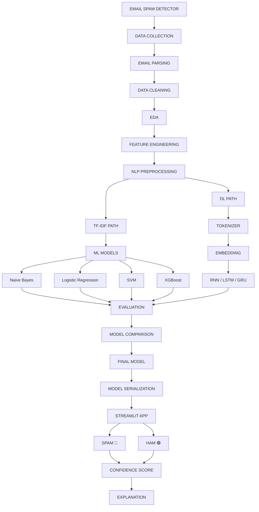

# 📧 Email Spam Detector

## Project Workflow



## 🔄 Execution Flow

1. **Data Collection**

   * Collect spam and legitimate (ham) emails.
   * Combine datasets from reliable sources.
   * Create a unified dataset containing email text and labels.

2. **Email Parsing**

   * Extract useful information from raw emails.
   * Separate subject, body, sender, receiver, and other metadata.
   * Remove unnecessary HTML and email headers when required.

3. **Data Cleaning**

   * Handle missing values and duplicates.
   * Remove irrelevant or corrupted emails.
   * Normalize text and clean unnecessary characters.

4. **EDA — Exploratory Data Analysis**

   * Analyze spam vs. ham distribution.
   * Analyze email length and word frequency.
   * Identify common spam-related words.
   * Visualize class distribution and text characteristics.

5. **Feature Engineering**

   * Create useful features from email content.
   * Examples:

     * Email length
     * Word count
     * Character count
     * Number of URLs
     * Number of special characters
     * Number of uppercase words
     * Number of digits
     * Number of HTML tags

6. **NLP Preprocessing**

   * Convert text into a clean NLP-ready format.
   * Perform:

     * Lowercasing
     * Tokenization
     * Stop-word removal
     * Punctuation removal
     * Stemming or lemmatization

7. **TF-IDF + Machine Learning Path**

   * Convert email text into numerical vectors using **TF-IDF**.
   * Train multiple machine-learning models:

     * Naive Bayes
     * Logistic Regression
     * SVM
     * XGBoost
   * Evaluate each model using appropriate classification metrics.

8. **Deep Learning Path**

   * Tokenize email text.
   * Convert tokens into sequences.
   * Apply padding.
   * Generate word representations using an embedding layer.
   * Train deep-learning models:

     * RNN
     * LSTM
     * GRU

9. **Model Evaluation**

   * Compare models using:

     * Accuracy
     * Precision
     * Recall
     * F1-score
     * ROC-AUC
     * Confusion Matrix

10. **Model Comparison**

    * Compare traditional ML and deep-learning approaches.
    * Consider both **performance and inference/training time**.
    * Select the model that provides the best balance for the project.

11. **Final Model**

    * Select the best-performing model.
    * Retrain it using the final training dataset if necessary.
    * Test it on unseen emails.

12. **Model Serialization**

    * Save the trained model.
    * Save the required preprocessing objects such as:

      * TF-IDF vectorizer
      * Tokenizer
      * Label encoder
    * Possible formats:

      * `.pkl`
      * `.joblib`
      * `.keras`

13. **Streamlit Application**

    * Create a web interface where the user can enter or paste an email.
    * Apply the same preprocessing pipeline used during training.
    * Send the processed email to the trained model.

14. **Prediction**

    * Classify the email as:

      * 🔴 **SPAM**
      * 🟢 **HAM**

15. **Confidence Score**

    * Display the model's prediction probability/confidence.
    * Example:

      * Spam: **96.8%**
      * Ham: **3.2%**

16. **Explanation**

    * Provide understandable reasons behind the prediction.
    * Highlight important words or patterns that influenced the classification.
    * For example:

      * Suspicious URLs
      * Promotional phrases
      * Excessive special characters
      * Urgency-related words
      * Financial/scam-related terminology

## 🧠 Technology Stack

| Component          | Technologies                         |
| ------------------ | ------------------------------------ |
| Programming        | Python                               |
| Data Processing    | Pandas, NumPy                        |
| Visualization      | Matplotlib, Seaborn                  |
| NLP                | NLTK / spaCy                         |
| Feature Extraction | TF-IDF                               |
| Machine Learning   | Scikit-learn, XGBoost                |
| Deep Learning      | TensorFlow / Keras                   |
| Models             | NB, LR, SVM, XGBoost, RNN, LSTM, GRU |
| Model Saving       | Joblib / Pickle / Keras              |
| Deployment         | Streamlit                            |

## 🎯 Final Project Architecture

```text
Raw Emails
    ↓
Email Parsing
    ↓
Data Cleaning
    ↓
EDA
    ↓
Feature Engineering
    ↓
NLP Preprocessing
    ↓
 ┌───────────────────────┐
 │                       │
 ▼                       ▼
TF-IDF                 Tokenizer
 │                       │
 ▼                       ▼
ML Models              Embedding
 │                       │
 │                  RNN/LSTM/GRU
 │                       │
 └───────────┬───────────┘
             ↓
      Model Evaluation
             ↓
      Model Comparison
             ↓
        Final Model
             ↓
      Model Serialization
             ↓
       Streamlit App
             ↓
    ┌────────┴────────┐
    ↓                 ↓
  SPAM 🔴           HAM 🟢
    │                 │
    └────────┬────────┘
             ↓
      Confidence Score
             ↓
        Explanation
```

## 📌 Project Goal

> Build an end-to-end **Email Spam Detection System** using NLP, Machine Learning, and Deep Learning that can classify emails as **Spam or Ham**, provide a confidence score, and explain the major factors behind the prediction.

